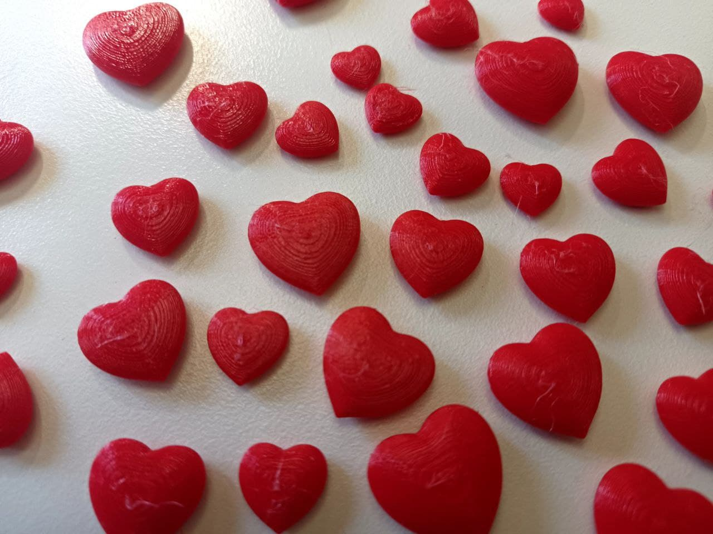
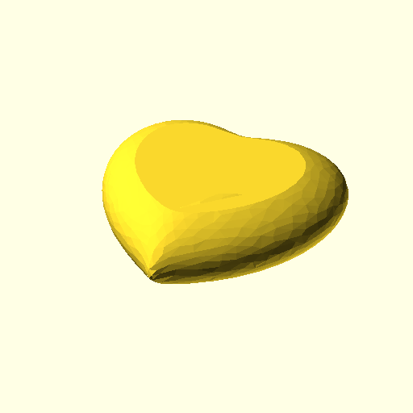
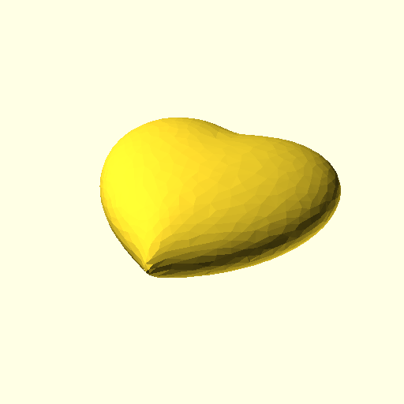
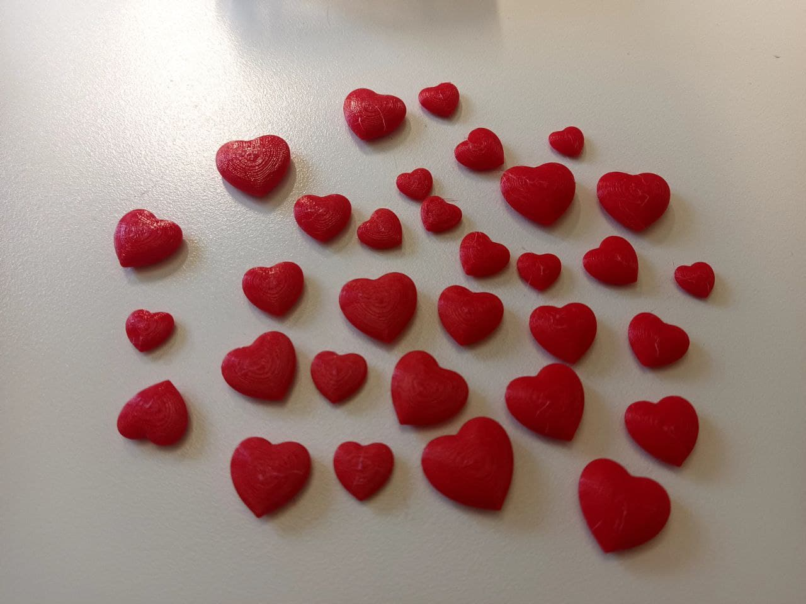

# Love Heart (Medium Resolution)




## Description

For anyone trying to print small 10mm x 10mm love hearts, the original Love Heart (High Res) https://www.thingiverse.com/thing:3235897 is way too large in file size that it is hard to manipulate.

This is just a remix of the original high res file, but shrunken down to 10mm x 10mm, fixing any non manifolds to ensure good 3D prints, and reducing number of triangles to a manageable level for the size.

There is also three different cut options in case you want a flat bottom for easier printing, top and bottom cut for cleaner surface finish, or no cuts (but support required) for nicer look.

Of course if you resize it bigger, it will be less smooth, but this will be good enough for 10mm by 10mm size 3D print. Support usually not required. However I left in a larger resolution model just in case in the smallHeartMoreTriangle folder.

This print is also located at:
- https://www.thingiverse.com/thing:5243565

### Remix Of

This is a remix of

- https://www.thingiverse.com/thing:3235897 - Love Heart (High Res) by CptPicard November 25, 2018
- https://www.thingiverse.com/thing:6190 - Exploitable Heart by emmett February 07, 2011

### License

This License is inheriting from Exploitable Heart by emmett so this is licensed under the Creative Commons - Attribution - Share Alike license.

-------------------------------------------------------------------------------

## Model Options

There is three set of files from 10x10mm to 40x40mm in the stl folder

### flatTopBottom (No Support required)



This is both cut on top and bottom.
Personally I don't quite like this design visually, but it does allow for drawing messages on the top with a marker.

### flatBottom (No Support Required)



This is a flat bottom which allows for safer no support required 3D printing.

### supportRequired (Support Required)


This is a full sized love heart, you will need to print support to avoid problem with 3D printing this object.
This might be what you want to use if you are trying to have a nice looking love heart on both sides for presentation purpose like hanging on a wire.

--------------------------------------------------------------------------------

## Building

This uses a makefile to generate the various model options and sizing

To generate them all. Just delete all the files in the stl folder and png folder and run this command

```
make
```

You can also just run `make imageRender` to render just the image.

You can also just run `make flatTopBottom` to render only the flatTopBottom stl files.

You can also just run `make flatBottom` to render only the flatBottom stl files.

You can also just run `make supportRequired` to render only the supportRequired stl files.


--------------------------------------------------------------------------------

## Tools used

    * https://3dless.com/ - Reduce filesize and complexity
    * https://www.meshmixer.com/ - fix manifold errors via inspector tools
    * https://www.openscad.org/ - to generate the various cut and sizing options

--------------------------------------------------------------------------------


